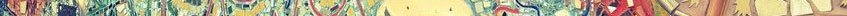
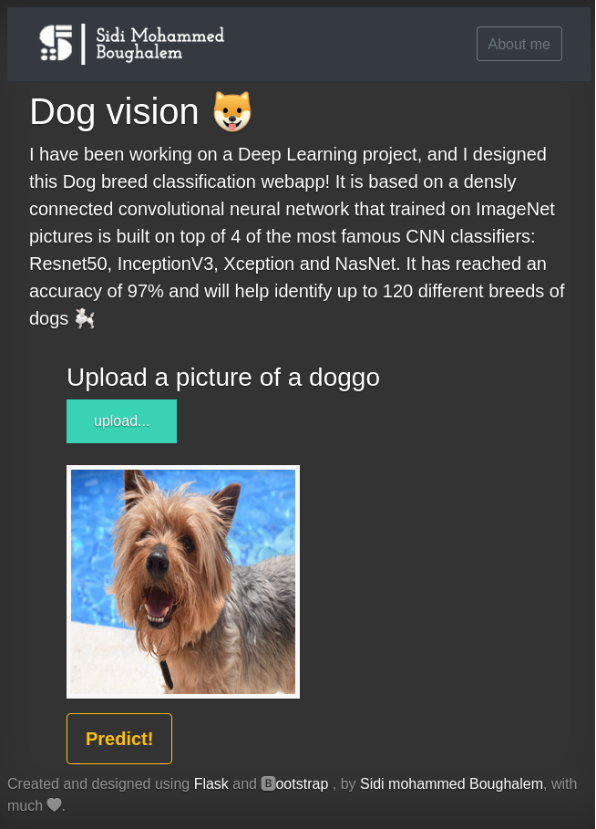

# Dog vision

I have been working on a Deep Learning project, and I designed this Dog breed classification webapp. It uses transfer learning and the desnly connecter neural netwerk has reached an accuracy of 97%. It will help identify up to 120 different breeds of dogs 🐩

In addition to the Notebook, you can locally run the webapp on your computer as follow:

### Get down to business!
1. Clone this repo: `git clone git@github.com:Sithlord-dev/Dog_vision.git`
2. Change to the repo directory: `cd Dog_vision`
(optional :  If you want to use virtualenv: `virtualenv ENV && source ENV/bin/activate`)
4. Install dependencies with pip: `pip install -r requirements.txt`
7. Run the app: `python ./app.py`

You can start the api server with `gunicorn web:app --reload --port 5000`

Or the Notebook with : 
